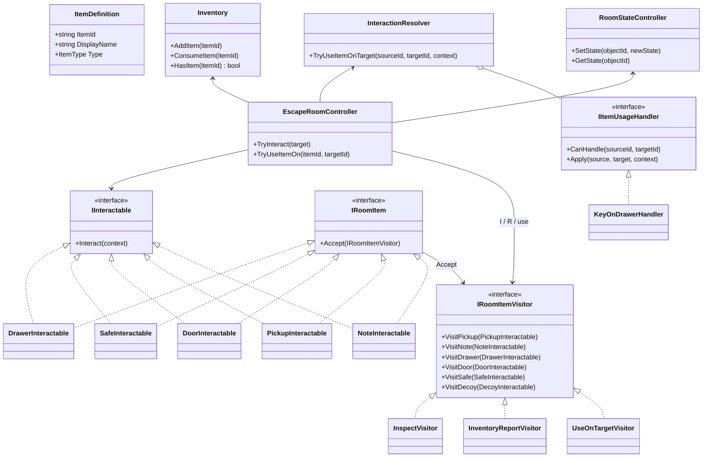
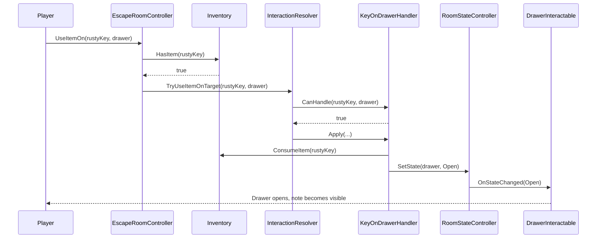
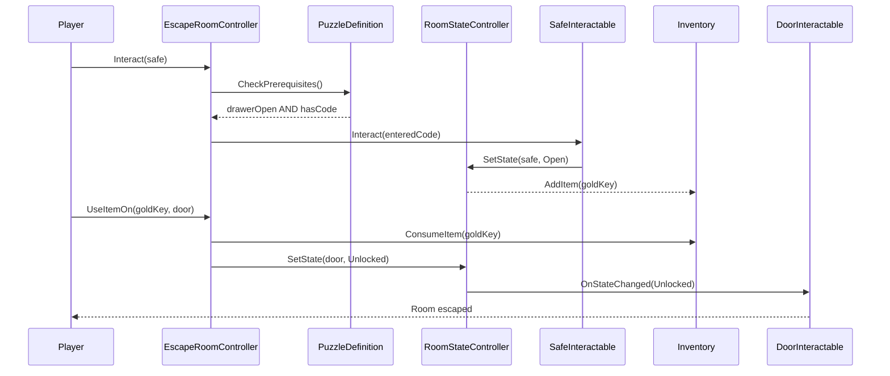
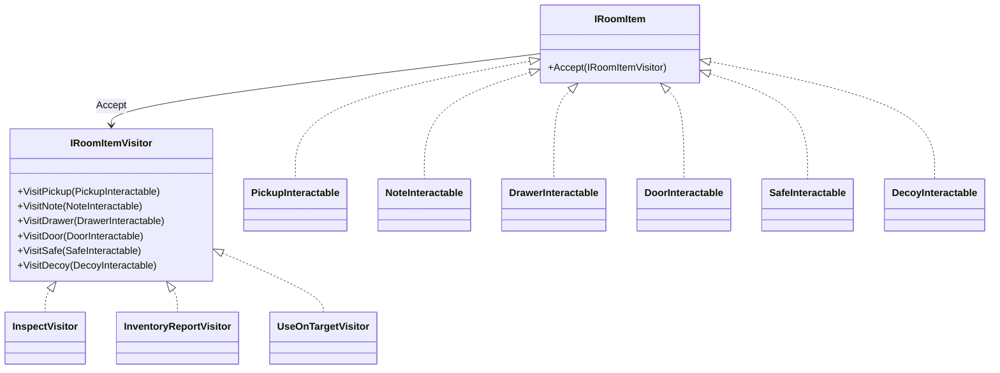

# Escape Room — Architecture & Implementation (Part 3)

> Part 3 includes both **architecture deliverables** (diagrams) and a **playable mini escape room** in Unity.

**Playable scene:** `Assets/Scenes/EscapeRoom.unity`  
**Docs viewer:** `Assets/Scenes/EscapeRoomArchitecture.unity`  
**Walkthrough:** [Walkthrough.md](Walkthrough.md)

**Exported diagrams for submission (PNG):**

- [class_diagram.png](class_diagram.png) — full room architecture **including Visitor**
- [visitor_class_diagram.png](visitor_class_diagram.png) — Visitor class diagram
- [sequence_item_on_item.png](sequence_item_on_item.png)
- [sequence_puzzle_door.png](sequence_puzzle_door.png)

Source: `.mmd` files in this folder (regenerate with `npx @mermaid-js/mermaid-cli -i file.mmd -o file.png`).

## Design Goals

- Grow the room by adding spawn entries on `EscapeRoomSetupSO` (and related assets)
- Configure puzzle order with `InteractionRuleSO` and `PuzzleDefinition`
- Keep collected and used inventory items separate (slots = found, `Used:` = consumed)
- Support ordered dependencies between actions
- Drive room state changes (drawer open, note revealed, door unlocked)

## How to extend

1. Add a `RoomObjectSpawn` on `EscapeRoomSetup` (kind, position, color, optional `ItemId`).
2. Add an `ItemDefinition` and/or `InteractionRuleSO` when needed, and register them on the setup asset.
3. Update `PuzzleDefinition` prerequisites / safe code and `InitialStates` if the chain changes.
4. Press Play — the room is built from the setup data.

## Core Patterns

| Concern | Pattern | Reference |
|---------|---------|-----------|
| Item definitions | ScriptableObject data | Data-driven design |
| Room state changes | State + Observer | [State](https://www.unitydesignpatterns.com/patterns/state), [Observer](https://www.unitydesignpatterns.com/patterns/observer) |
| Item-on-item usage | Strategy / Resolver | [Strategy](https://www.unitydesignpatterns.com/patterns/strategy) |
| Puzzle prerequisites | Composite conditions | [Composite](https://www.unitydesignpatterns.com/patterns/composite) |
| Multi-operation on room items | Visitor | [Visitor](https://www.unitydesignpatterns.com/patterns/visitor) |

**Part 4 (Unseen) — Visitor:** used in Crimson Mini Room. **I** / **R** run Inspect / InventoryReport; item+click uses `UseOnTargetVisitor`.

## Room Content (≥5 object types)

| Object | `RoomObjectKind` | Role |
|--------|------------------|------|
| Rusty Key | Pickup (collectible) | Goes to inventory |
| Drawer | Drawer | Opens when rusty key is used |
| Note | Note | Readable; reveals code after drawer opens |
| Safe | Safe | Opens with code `7391` |
| Gold Key | Pickup (from safe) | Added when safe opens |
| Door | Door | Opens with gold key |
| Red Box | Decoy | Dead end; message goes to the log only |

### Ordered Dependencies (4)

1. Use **Rusty Key** on **Drawer** → drawer opens
2. Read **Note** (only visible after drawer opens) → player learns code
3. Enter code on **Safe** → safe opens and adds **Gold Key**
4. Use **Gold Key** on **Door** → escape

## Class Diagram

Includes **Visitor** (`IRoomItem` / `IRoomItemVisitor` / Inspect · InventoryReport · UseOnTarget). See also [visitor_class_diagram.png](visitor_class_diagram.png).

## Sequence Diagram — Use Item On Item

## Sequence Diagram — Solve Puzzle / Open Door

## How to add content

1. Append a `RoomObjectSpawn` on `Assets/Part3_EscapeRoom/Resources/EscapeRoomSetup.asset`.
2. For pickups: create an `ItemDefinition`, set matching `ItemId`, and add it to `EscapeRoomSetupSO.Items`.
3. For item-on-object use: add an `InteractionRuleSO` and register it under `InteractionRules`.
4. For puzzle steps: update `PuzzleDefinition` and `InitialStates` as needed.
5. Press Play — `RoomObjectFactory` builds the room from `Spawns`.

New objects of an existing kind are mostly asset work; a brand-new kind needs a factory branch.

## Visitor — operations over room items

Puzzle rules use Strategy/Resolver. Inspect-all, room report, and typed item-use dispatch use **Visitor**.

### Adding a new operation

1. Implement a new `IRoomItemVisitor`.
2. Handle each `Visit*` method for the existing item types.
3. Invoke it from `EscapeRoomGameController` (same idea as **I** / **R**).

Adding a new item type means extending the visitor interface and every visitor implementation.

### In play

- Part 3 → **Crimson Mini Room**
- **I** Inspect all · **R** Room report · inventory + click = Use via Visitor
- Code: `Assets/Part3_EscapeRoom/Scripts/`
